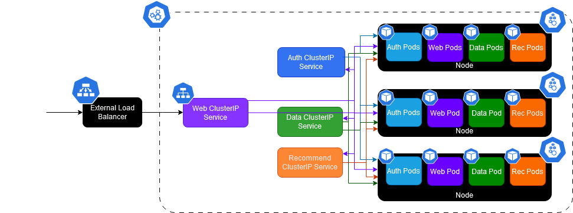
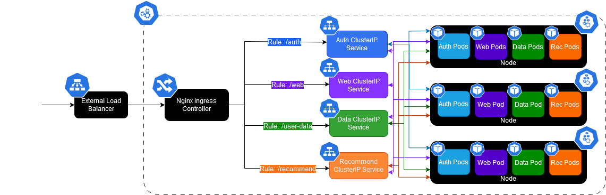
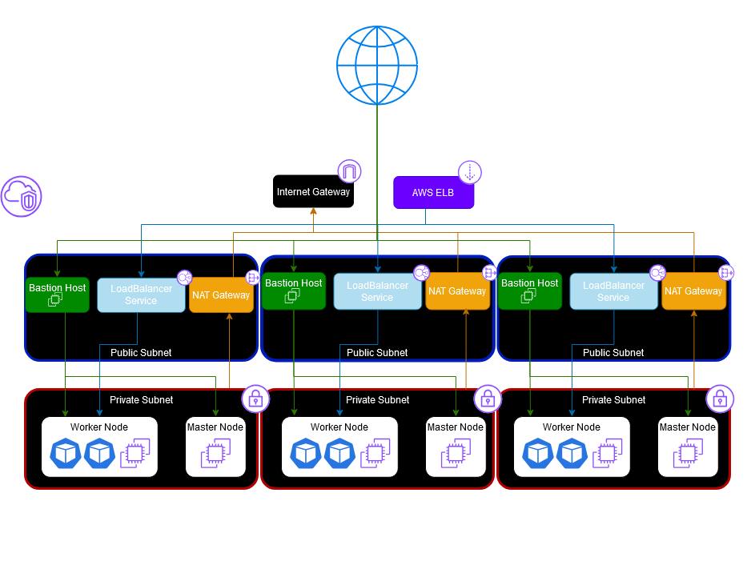

# AWS-Deployment

## Application Overview:
This application demonstrates the deployment of a microservice web application using containers written in GoLang. The application consists of four microservices: an authentication service, a data service, a recommendation service, and a frontend/web service, which are all designed to be extremely lightweight, scalable, and easy to deploy on Kubernetes, making the deployment ideal for cloud-native environments.

## Why use it? 
The installation process is extremely simplified, thanks to the use of Kubernetes, Terraform, and Helm. These tools work seamlessly together to provide a lightweight and scalable solution that's ready for cloud-native environments. With just a few simple steps, you can have all the necessary resources up and running on AWS, allowing you to focus more on coding and less on setup.

After installing the necessary tools, configuring and deploying the application to suit your specific needs is a breeze. Everything inside the Helm chart is templated for easy customization, including configuration settings for defining, installing, and managing all the Kubernetes resources needed. You can also tweak AWS regions, adjust dynamic Availability Zone settings, and manage  environment separation with ease. The application follows the best practices for cloud resource management and can easily be accessed through the public URL, allowing you to test and validate the deployment quickly.

Finally, the application is built with high availability in mind, being designed to support rolling updates, minimizing downtime, and ensuring that your application remains accessible. With worker nodes strategically placed across multiple private subnets and Availability Zones, your application benefits from horizontal scaling and redundancy. This setup ensures that even during high traffic or unexpected failures, your application remains robust and responsive.

### Installation/Deployment:
After cloning the repository, follow the instructions below to deploy the application to AWS using Terraform and Helm:

* Try the [local installation guide](assets/installation.md) first to test out the application on your local machine

* Try the [cloud deployment guide](assets/deployment.md) for detailed instructions on deploying the application to AWS

## Future Improvements:

### [Internal Load Balancing](https://kubernetes.io/docs/concepts/services-networking/service/#internal-load-balancer)
While the Nginx ingress controller has some limited internal load-balancing capabilities, it is not designed for high-performance in large scale scenarios. A separate internal load balancer can be provisioned within the VPC to route traffic between the microservices within the cluster. This can help improve the performance of the application by distributing the load evenly across the services.

### [External DNS Management](https://github.com/kubernetes-sigs/external-dns)
Using an external DNS tool allows automatic management of DNS records for services like the Load Balancer to use a consistent fully qualified domain name (FQDN) from Route53 instead of one randomly generated by AWS, which can be useful for production deployments where external services should be easiy accessible with convenient domain names.

### Other Traffic Distribution Methods
Some concepts I would like to explore further to optimize the networking configuration for larger-scale deployments include:
- [Topology Aware Routing](https://kubernetes.io/docs/concepts/services-networking/topology-aware-routing/#enabling-topology-aware-routing): This feature allows the cluster to route traffic based on the location of the client, which can help reduce latency and improve performance for geographically distributed applications.
- [Service Internal Traffic](https://kubernetes.io/docs/concepts/services-networking/service-traffic-policy/#using-service-internal-traffic-policy): This feature allows for more control over the routing and security of internal traffic within the cluster.

### [Cluster Autoscaler](https://kubernetes.io/docs/concepts/cluster-administration/cluster-autoscaling/)
Currently, the Kubernetes cluster handles autoscaling by increasing the number of pod Replica Sets based on the resource requirements. A Cluster Autoscaler should also be configured to automatically add/remove nodes based on the resource requirements of the pods, which lets it optimize cluster utilization and respond better to changes in demand.

### [HTTPS Certificate Generation](https://kubernetes.io/docs/tasks/tls/managing-tls-in-a-cluster/)
A better approach for production usage would be to use a certificate authority like Let's Encrypt to generate SSL certificates, and swap the ingress controller from Nginx to Traefik to enable TLS termination. This enables HTTPS for the application and ensures secure communication between the client and the server.

### [EC2 Spot Instances](https://aws.amazon.com/tutorials/run-kops-kubernetes-clusters-for-less-with-amazon-ec2-spot-instances/)
A combination of EC2 spot instances and persistent volume claims can be used to store data on the worker nodes and retain similar functionality to the EC2 on-demand instances that are used currently in the project. This requires templating the instance groups generated by kOps to change the node type and add node termination handling, but will be more cost-effective in the long run.

### [Monitoring and Logging](https://www.youtube.com/watch?v=hJoH7J0un5U&t=1s)
Implementing monitoring and logging for real-time cluster performance tracking and centralized log management/error tracking can help in identifying and resolving issues quickly. Helm charts will be added soon to enable the deployment of monitoring and logging tools like Prometheus, Grafana, ELK stack, and Fluentd to the cluster, which will all be configured to collect metrics from the application's cluster resources.

## Implementation Details:

### Helm Chart :
A Helm chart is used to define, install, and manage the Kubernetes resources required for the application in a single step. The chart includes templates for deploying all pods, services, and an optional ingress for routing traffic to internal endpoints for testing. The Helm chart makes heavy use of variable value files, making it extremely easy to customize the deployment configuration.

```
AWS-Deployment
├── .helmignore
├── chart.yaml
├── values.yaml
├── charts
└── templates
    ├── _helpers.tpl
    ├── auth-deployment.yaml
    ├── data-deployment.yaml
    ├── ingress.yaml
    ├── notes.txt
    ├── rec-deployment.yaml
    ├── services.yaml
    └── web-deployment.yaml
```

#### **Load Balancer**:
In production scenarios that usually only require external traffic to be directed to the front-end service, and internal services are meant to stay internal (only accessible within the cluster or VPC), the external load balancer allows inbound traffic on port 80 (for HTTP) and will route traffic directly to the front-end service, which will then handle the internal routing to the other services:



#### **Ingress Controller**:
While normally these services are not exposed to the public internet, an ingress controller can be enabled to allow for easy testing and validation of the application before going live by routing external traffic to the services for testing the internal endpoints. The Ingress resource uses a fanout configuration that maps incoming requests by their endpoint to the corresponding services, removing the need for multiple load balancers:



#### **Horizontal Scaling**:
The chart ensures high availability of the application by making use of ReplicaSets to deploy three replicas of each service pod, which can handle increased traffic and load. The ReplicaSets are also configured with liveness probes to help with startup and container running states, ensuring that the application is always available and responsive.

### Terraform Infrastructure:
Terraform is employed to provision creation of the underlying network infrastructure, which is then leveraged by kOps for deploying and managing the Kubernetes cluster. The Terraform configuration is modularized into separate directories for each component, making it easy to manage and update the infrastructure as needed.

```
├── helm
│   ├── main.tf
│   ├── variables.tf
│   └── outputs.tf
├── kops
│   ├── main.tf
│   ├── variables.tf
│   └── outputs.tf
├── network
│   ├── main.tf
│   ├── variables.tf
│   └── outputs.tf
├── s3
│   ├── main.tf
│   ├── variables.tf
│   └── outputs.tf
├── main.tf
├── variables.tf
├── providers.tf
└── outputs.tf
```

#### **Network Architecture**:

The network architecture is designed to be modular and scalable by making use of Terraform modules to dynamically generate and distribute resources such as subnets, NAT gateways and node instance groups across up to 5 Availability Zones. The following network resources are provisioned to maintain a secure and private network topology:



- VPC (Virtual Private Cloud): configured with both public and private subnets to segregate internet-facing and internal services.
- Public Subnets: contain routes to the Internet Gateway (IGW) that host resources like Load balancers and services that need to be accessible from the public internet.
- Private Subnets: isolate backend microservices from public internet, only allowing inbound traffic from resources within the public subnets, and outbound traffic through NAT gateways.
- Internet Gateway (IGW): enables internet access for resources in public subnets, allowing them to interact with external services.
- NAT Gateway: provides outbound internet access for resources in private subnets, enabling tasks like pulling updates or external API calls while blocking inbound traffic.

### Kubernetes Cluster:
The Kubernetes cluster is deployed using kOps, which automates the creation and management of Kubernetes clusters on AWS. The cluster is bootstrapped with the necessary control plane, worker nodes, and security groups for the networking components provisioned by Terraform are configured to ensure secure and efficient communication between the cluster components. 

#### **Hardware Configuration**: 
The instance group utilizes T3 instances for the worker nodes, which are ideal for microservices and low-latency interactive applications. Security groups are automatically created and attached to ensure secure communication between the nodes and external services.  

#### **Network Configuration**:
The cluster is configured to use gossip-based DNS for internal DNS resolution within the cluster, by configuring the cluster domain name to end with .k8s.local. This eliminates the need for external DNS services like Route 53, making it ideal for testing environments by reducing costs and complexity.

kOps is smart enough to automatically map the master nodes to the private subnets and the utility (public) subnets to AWS resources like load balancers or NAT gateways that need public IP addresses. The worker nodes will also be placed in the private subnets by default, with access to the internet via the NAT gateway in the public subnet. This ensures the isolation of backend services from the public internet while allowing controlled access to external services through the loadbalancer.

#### **Bastion Hosts**:
Bastion hosts can optionally be deployed for performing administrative tasks on the master and worker nodes within the private subnets via SSH. The bastion hosts are distributed in the utility (public) subnets and are configured with security group rules to allow SSH access from any public IP range with the corresponding key. This provides a secure way to access the cluster nodes for debugging, maintenance, or troubleshooting purposes.