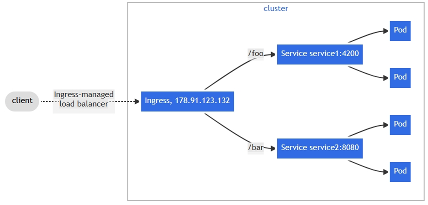

# AWS-Deployment

## Application Overview:

This application demonstrates a microservice web architecture using Golang components. The application consists of four microservices: an authentication service, a data service, a recommendation service and a frontend/web service. The application is designed to be extremely lightweight, scalable, and easy to deploy on Kubernetes, making it ideal for cloud-native environments. You can view the application code Docker containers in the docker-container folder.

## Why use it? 

This setup is ideal for developers looking to deploy a microservice-based application on Kubernetes. The application is designed to be lightweight, scalable, and easy to deploy, making it ideal for cloud-native environments. The use of Kubernetes, Terraform, and Helm provides a robust and flexible foundation for running secure, scalable applications on AWS.

After installing the necessary tools, you can deploy the application to AWS using Terraform and Helm. The deployment process is straightforward and can be customized to suit your specific requirements. The application can be accessed through a public URL or an Ingress controller, allowing you to test the deployment and validate the setup.

Deployment is a breeze with the provided Helm chart, which defines, installs, and manages the Kubernetes resources required for the application in a single step. The chart includes templates for deploying the frontend, authentication, data, and recommendation pods and services, making it extremely easy to customize the deployment configuration.

Not to mention configuration...

This infrastructure supports rolling updates to minimize downtime during deployments and ensures that worker nodes are placed in private subnets within their respective Availability Zones for high availability. Overall, this setup offers a robust and flexible foundation for running secure, scalable applications on AWS.

High availability:
subnet per AZ, node per AZ, etc.
horizontal scaling support

### Installation/Deployment:

After cloning the repository, follow the instructions below to deploy the application to AWS using Terraform and Helm:

* Try the [local installation guide](installation.md) first to test out the application on your local machine

* Try the [cloud deployment guide](deployment.md) for detailed instructions on deploying the application to AWS

## Future Improvements
- hardening: 
	- internal load balancing
	- Cluster Autoscaler: curl -O https://raw.githubusercontent.com/kubernetes/autoscaler/master/cluster-autoscaler/cloudprovider/aws/examples/cluster-autoscaler-one-asg.yaml
	- kops can autoscale as well: The worker nodes will be part of an autoscaling group. Autoscaling will be managed by cluster-autoscaler
- Modifying the file to handle autoscaling 
- HTTPS certificate generation using traefik TLS
- Utilizing EC2 spot instances with persisting states
- Implementing monitoring and logging for real-time cluster performance tracking and centralized log management/error tracking

## Implementation Details:

### Helm Chart :
A Helm chart is used to define, install, and manage the Kubernetes resources required for the application in a single step. The chart includes templates for deploying the frontend, authentication, data, and recommendation pods and services and an optional ingress for routing traffic to internal endpoints for testing. The Helm chart makes heavy use of templating and variable value files, making it extremely easy to customization of the deployment configuration.

```
AWS-Deployment
├── .helmignore
├── chart.yaml
├── values.yaml
├── charts
└── templates
    ├── _helpers.tpl
    ├── auth-deployment.yaml
    ├── data-deployment.yaml
    ├── ingress.yaml
    ├── notes.txt
    ├── rec-deployment.yaml
    ├── services.yaml
    └── web-deployment.yaml
```

#### **Load Balancer**:
When deploying on the cloud, an external load balancer is created to route traffic to either the frontend service or the ingress controller based on the configuration passed, which then routes the traffic to the appropriate service based on the hostname. 

If your architecture only requires external traffic to be directed to the front-end service, and internal services are meant to stay internal (only accessible within the cluster or VPC), you can simplify your setup by using The external load balancer allows inbound traffic on the necessary ports (e.g., port 80 for HTTP or port 443 for HTTPS) and will route traffic directly to the front-end service, which will then handle the internal routing to the other services. 

#### **Ingress Controller**:
Normally these services are not exposed to the public internet, but an ingress controller can be enabled to allows for easy testing and validation of the application before going live by routing external traffic to the services for testing the internal endpoints. In the provided Kubernetes manifests, the Ingress resource uses a fanout configuration that maps incoming requests by their endpoint to the corresponding services. This set allows you to keep the number of load balancers down to a minimum:




#### **Horizontal Scaling**:
The chart makes use of ReplicaSets to ensure high availability and scalability of the application. By default, the chart deploys three replicas of each service to ensure that the application can handle increased traffic and load. The ReplicaSets are configured with liveness probes to help with startup and container running states, ensuring that the application is always available and responsive.

#### **Annotations**:
The Ingress controller is configured with annotations to enable path-based routing and rewriting. The annotations specify how to rewrite the request path and enable the use of regex in the path field, allowing for more flexible path matching and rewriting. The annotations are used to define the path definitions and rewrite targets for the Ingress controller, ensuring that incoming requests are routed to the correct services based on the request path.

Regex Path Definitions:
- `path: /auth(/|$)(.*)`: Matches `/auth`, `/auth/`, and any path starting with `/auth/`. The `(.*)` captures the remaining part of the path after `/auth/`.

Rewrite Targets:
- `nginx.ingress.kubernetes.io/rewrite-target: /$2`: This annotation specifies how to rewrite the request path. The `$2` captures the part of the path after the prefix. For example, `www.coolwebsite.com/auth/version` would be rewritten to `www.coolwebsite.com/version`.

### Terraform Infrastructure:
Terraform is employed to provision creation of the underlying network infrastructure, including VPCs, subnets, routing tables, IGWs, NAT gateways, which are then leveraged by kOps for deploying and managing the Kubernetes cluster. The Terraform configuration is modularized into separate directories for each component, making it easy to manage and update the infrastructure as needed.

```
├── helm
│   ├── main.tf
│   ├── variables.tf
│   └── outputs.tf
├── kops
│   ├── main.tf
│   ├── variables.tf
│   └── outputs.tf
├── network
│   ├── main.tf
│   ├── variables.tf
│   └── outputs.tf
├── s3
│   ├── main.tf
│   ├── variables.tf
│   └── outputs.tf
├── main.tf
├── variables.tf
├── providers.tf
└── outputs.tf
```

#### **Network Configuration**:

The network configuration makes heavy use of Terraform modules to dynamically generate and distribute resources such as subnets, NAT gateways and node isntance groups across availability zones to ensure high availability of the application. The network configuration is designed to be modular and scalable, allowing for easy customization and expansion as needed, enabling upto 5 availability zones to be specified for the deployment. To maintain a private network topology for security the following network resources are provisioned:
- VPC (Virtual Private Cloud): Configured with both public and private subnets to segregate internet-facing and internal services.
- Public Subnets: Subnets with routes to the Internet Gateway (IGW) that host resources like Load balancers and services that need to be accessible from the public internet are typically configured in public subnets.
- Private Subnets: Isolates backend microservices from public internet, adding a layer of security by strictly allowing access by resources within the VPC such as the loadbalancer in the public subnet or outbound traffic through controlled access points like NAT gateways.
- Internet Gateway (IGW): Enables internet access for resources in public subnets, allowing them to interact with external services.
- NAT Gateway: Provides outbound internet access for resources in private subnets, enabling tasks like pulling updates or external API calls while blocking inbound traffic.

### Kubernetes Cluster:
The Kubernetes cluster is deployed using kOps, which automates the creation and management of Kubernetes clusters on AWS. The cluster is bootstrapped with the necessary control plane and worker nodes, and security groups for the networking components provisioned by Terraform are configured to ensure secure and efficient communication between the cluster components. Features like Gossip DNS and bastion hosts are strategically implemented to ensure internal DNS resolution, secure internet access, and controlled administrative access to the cluster.

#### **Hardware Configuration**: 
The instance group utilizes T3 instances for the worker nodes, which are ideal for microservices and low-latency interactive applications. Security groups are automatically made and attached to ensure secure communication between the nodes and external services.  

#### **Network Configuration**:
The cluster is configured to use gossip-based DNS for internal DNS resolution within the cluster, by configuring the cluster domain name to end with .k8s.local. This eliminates the need for external DNS services like Route 53, making it ideal for testing environments by reducing costs and complexity. This setup works well with private subnets because the DNS resolution is entirely internal to the cluster and doesn’t require any external network access. The security groups for the networking components such as VPC, subnets, and route tables are configured to ensure secure communication between the cluster components.

kOps is smart enough to automatically map the master nodes to the private subnets and the utility (public) subnets to AWS resources like load balancers or NAT gateways that need public IP addresses. The worker nodes will also be placed in the private subnets by default, with access to the internet via the NAT gateway in the public subnet. This ensures isolation of backend services from the public internet while allowing controlled access to external services through the loadbalancer. kOps also distributes the network resources across availability zones for high availability. This ensures that if one availability zone goes down, the cluster can still function with the resources in the other availability zones.

#### **Bastion Hosts**:
Bastion hosts can optionally be deployed to enable SSH access to the master and worker nodes within the private subnets. The bastion hosts are placed in the utility (public) subnets and are configured with security group rules to allow SSH access from any public IP range with the corresponding key. This provides a secure way to access the cluster nodes for debugging, maintenance, or troubleshooting purposes. These bastion hosts are not required for normal operation of the cluster but can be useful for administrative tasks, and are additionally distributed across availability zones.